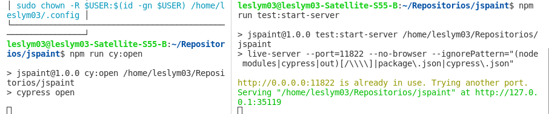
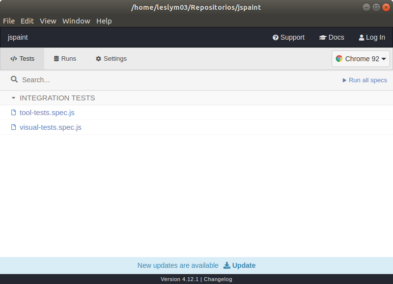
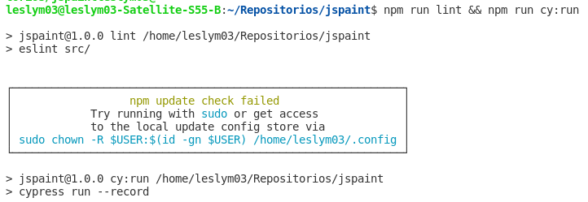
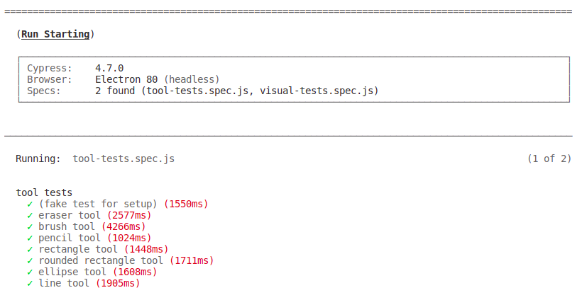
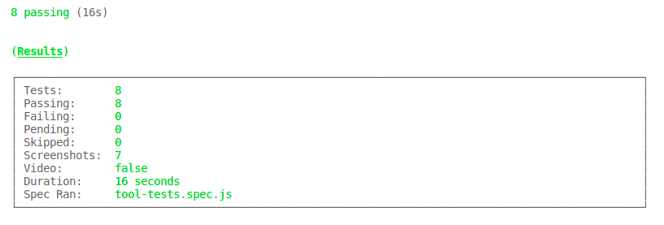
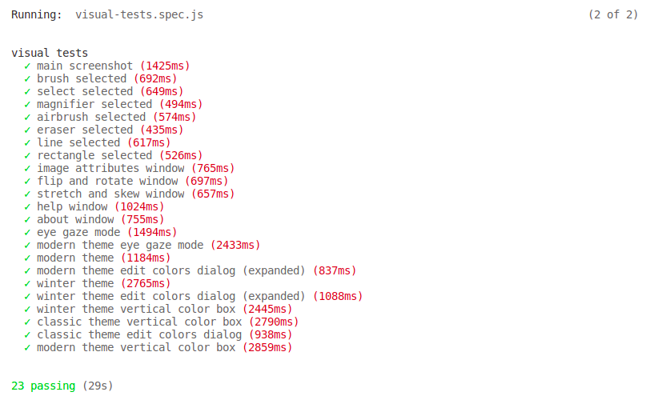
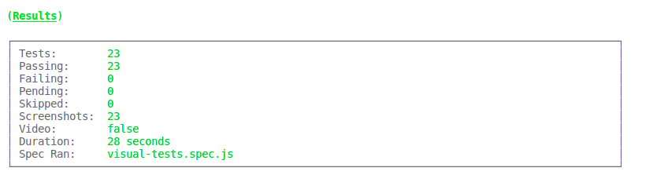

# PruebasJSPaint

Se utilizo [JSPaint](https://github.com/1j01/jspaint) es un remake de Paint basado en web y aplicacion de escritorio multiplataforma. 

Se desarrrollo los casos de pruebas en un [Excel](https://docs.google.com/spreadsheets/d/1eWlFOBNvzTJae3vXMyRuuX7Wi5z7oQF6J-DPbBsw-vE/edit?usp=sharing) donde se dividio en 6 hojas de calculo los casos de prueba:

- Tool
- Selection
- Mode and theme
- Image
- Help and Extras
- Commands

## Automatización de pruebas funcionales
Para el desarrollo de las pruebas funcionales y unitarias se utlizo la herramienta **Cypress** que es un framework que prueba el software desde la interfáz de usuario tambien incluye *Mocha, Chai* y *Sinon* para realizar pruebas unitarias.

Los scripts se encuentran en la carpeta **integration**

- [tool-tests.spec.js](integration/tool-tests.spec.js)
- [visual-tests.spec.js](integratio/visual-tests.spec.js)


Se utilizo los siguientes comandos para comprobar si existen problemas de código y para ejecutar pruebas basadas en navegador con Cypress.

```
npm run lint && npm run cy:run
```

Para abrir la interfaz de usuario de Cypress, Se ejecuto en una terminal
```
npm run test:start-server
```
y luego al mismo tiempo en otra terminal
```
npm run cy:open
```


Obteniendo como resultado la interfaz de Cypress 




## Reporte con resultados de casos de prueba implementados 






